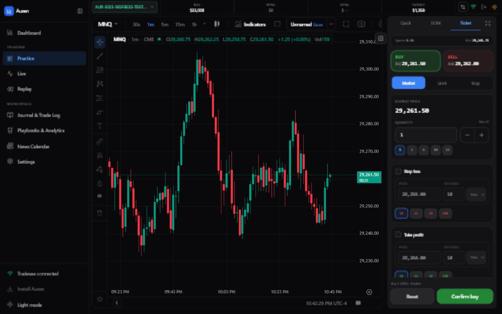

# Auren

**Practice-only** futures trading simulator. A safe layer between you and your real prop firm or eval account.

Create simulated **eval** and **funded** accounts, trade on live charts with real market data, and let rules, drawdowns, and lockouts play out on Auren. If you overtrade, revenge trade, or blow the account, your real prop firm balance stays untouched.



## Features

### Auren (home)

- Simulated **25K / 50K / 100K** eval and funded accounts: create, reset, delete
- Editable, unique Auren account IDs such as `AUR-E025-XXXXXXXX-TEST###`
- **Custom rules** when opening an account: profit target, max loss, drawdown type, consistency, commissions, contract caps
- **Tradesea** market data for practice charts
- Account states: **active**, **passed**, **blown** with dashboard stats
- Embedded **settings**: profile, market data, keyboard shortcuts, timezone

### Trading terminal

- **[BetterweightChartPro](https://github.com/parbhatc/BetterweightChartPro)** charts (ProChart engine, drawings, indicators) with Tradesea market data
- **Practice simulation** and **live Tradesea** trading on the same chart stack
- Collapsible desktop sidebar and order ticket for a chart-focused workspace
- **DOM ladder** and order ticket: market, limit, join bid/ask, close, reverse, flatten, cancel-all
- **Draggable SL/TP** on the chart; bracket tracking when offline (where supported)
- **Detachable** trade panel and **resizable** layout regions
- **Eval progress** on-chart: balance, trailing max loss, profit target, consistency

### Session discipline

- **Daily loss lockout** (session resets 6pm ET)
- **Max trades per session** (optional)
- **Self-lock** presets or custom duration; manual unlock when ready
- **Lockout card** and header controls on the trade screen

### Stats and news

- **Evaluation dashboard**: drawdown cushion, consistency, profitable days, trade history
- **Economic calendar** with currency and impact filters while you practice

### Market data

- Connect **Tradesea** via email OTP or manual session cookies
- **MDS WebSocket** stream: candles, last price, depth, quotes
- Connection status, auto-reconnect, and **connect on limit** (retries when the firm connection cap is hit)
- **Offline mode** option to hold an MDS slot and track brackets while away from the chart

### Mobile

- Bottom nav: chart, stats, news, order entry
- Compact-by-default **Quick trade** strip with expand and optional **floating** scalp pad
- Mobile order sheet and touch-friendly qty chips

### Platform

- Dark / light theme
- Auth: register, login, email verification, password reset
- Admin: users, roles, server config (self-hosted)
- **Backtester data management** (admin): symbol config, CSV inventory, TradingView / Tradesea download
- English UI copy via `en.json`

There is **no third-party prop-firm order routing** beyond Tradesea accounts you connect yourself. Practice accounts remain fully simulated on Auren.

### Historical backtester

- **CSV replay** on local historical bars (NQ, ES, GC, etc.) — no live market data required during replay
- **BetterweightChartPro replay mode** — step forward, play/pause, speed control, jump to bar, future candles dimmed
- **Session date navigation** — calendar pick, previous/next trading day with data
- **Simulated DOM trading** on replayed bars with eval rules (balance, drawdown, consistency)
- **Admin CSV pipeline** — download/update historical data from Tradesea or TradingView ([data management](#backtester-csv-data-admin))

## Product preview

The desktop terminal combines the shared Auren navigation rail, live account metrics, BetterweightChartPro charting, and a docked order ticket. Both the sidebar and ticket collapse independently when maximum chart space is needed. On mobile, the chart remains primary while Quick Trade and the full ticket move into compact touch-friendly controls.

## Routes

| Route | Purpose |
|-------|---------|
| `/` or `/dashboard` | Evaluation dashboard and account performance |
| `/practice` | Create and manage simulated eval/funded accounts |
| `/practice/trade/:id` | Practice trading terminal (chart + trade panel) |
| `/trade` | Live Tradesea trading terminal |
| `/journal` | Journal and trade log |
| `/analytics` | Playbooks and trading analytics |
| `/news` | Economic news calendar |
| `/backtester` | Historical backtester — session list |
| `/backtester/chart` | Replay chart + simulated trading |
| `/backtester/stats` | Backtester session statistics |
| `/backtester/data-management` | Admin: symbol config, CSV download/update |
| `/settings` | Profile and account settings |
| `/settings/props` | Market data / prop firm connection |
| `/settings/keyboard-shortcuts` | Terminal hotkeys |
| `/settings/utils` | Timezone and utilities |
| `/login`, `/register` | Authentication |

## Backtester replay system

The historical backtester replays **local CSV candles** through [BetterweightChartPro](https://github.com/parbhatc/BetterweightChartPro) replay mode. The chart UI and Auren server stay in sync so you only see bars up to the current replay time — future data is hidden and the DOM fills against replayed prices.

### Architecture

```text
BetterweightChartPro (replay toolbar)
        │  onReplayHostAction: play | pause | stepForward | selectBar | stepInterval
        ▼
BacktesterTradeHandler  ──WebSocket──▶  BacktesterWebSocket (/backtester-ws)
        │                                      │
        │                                      ├─ barCache.last = replay cursor
        │                                      ├─ CSVLoader + BacktesterBarsService
        ▼                                      └─ push bars to chart subscriptions
BacktesterChartDataFeed ◀── GET /backtester/history
```

### Chart replay (client)

`BacktesterChart` boots BWC with **host-controlled replay**:

| Option | Purpose |
|--------|---------|
| `replay: true` | Enable replay toolbar and engine |
| `replayHostControlled: true` | Auren drives play/pause/step (not inline BWC buttons) |
| `replayAutoEnter` / `replayPersistent` | Enter replay on load and keep session across refresh |
| `onReplayHostAction` | Bridge BWC events → `BacktesterTradeHandler` |

**User actions**

- **Step forward** — advance one playback candle (`nextCandle` on the server)
- **Play / pause** — timed playback at selected speed
- **Select bar** — click a candle to jump the replay cursor (`replay` message with unix time)
- **Step interval** — playback timeframe (e.g. 5m steps on a 1m chart); server aggregates from CSV

### Server replay (`/backtester-ws`)

After `sessionData` initializes the runtime, the server tracks `barCache.last` as the **replay cursor**. Messages:

| Message | Effect |
|---------|--------|
| `replay` `{ time }` | Jump to unix timestamp; clears per-symbol bar cache |
| `date_navigation` `{ direction, currentDate }` | Calendar / previous day / next day with CSV data |
| `nextCandle` `{ symbol, resolution, playbackTimeframe }` | Advance cursor; load and push the next bar(s) to subscribers |
| `subscribeBars` / `unsubscribeBars` | Chart subscriptions per symbol@resolution |

Historical bars are served from disk via `BacktesterBarsService` and `GET /backtester/history?symbol=&resolution=&from=&to=`. Minute+ chart resolutions aggregate from the `1m` CSV folder; native sub-minute (e.g. `30S`) reads `30s/` directly.

### TradingView replay (data admin only)

CSV **download/update** uses a separate TradingView WebSocket **replay session** (`server/src/services/tradingview/Replay.js`) to paginate historical candles into CSV files. That pipeline is admin-only (see [CSV data management](#backtester-csv-data-admin) below) and is not the same as the chart replay cursor above.

## Prerequisites

- [Node.js](https://nodejs.org/) 18+ (20 LTS recommended)
- npm 9+
- (Optional) Tradesea account for live/delayed futures chart data and live trading

## Quick start

### 1. Clone and install

```bash
git clone <repository-url>
cd Auren
npm install
cd server && npm install && cd ..
```

`npm install` pulls **[BetterweightChartPro](https://github.com/parbhatc/BetterweightChartPro)** from GitHub (`betterweightchartpro` dependency). No local sibling checkout is required.

`package-lock.json` is not committed. Run `npm install` in the repo root and in `server/` to generate lockfiles locally.

### 2. Chart engine (BetterweightChartPro)

Charts are powered by the open-source **[BetterweightChartPro](https://github.com/parbhatc/BetterweightChartPro)** package, installed automatically from GitHub:

```json
"betterweightchartpro": "git+https://github.com/parbhatc/BetterweightChartPro.git"
```

Vite serves `/chart/*`, `/js/*`, `/css/*`, `/vendor/*`, and `/testing/js/*` from `node_modules/betterweightchartpro/` during dev and copies them into `dist/` on production build.

To update to the latest chart release:

```bash
npm update betterweightchartpro
npm run build
```

Do **not** clone BetterweightChartPro next to Auren unless you intentionally set `BWC_ROOT`; the default installation uses `node_modules/betterweightchartpro`.

### 3. Environment

**Frontend** (optional):

```bash
cp .env.example .env
```

Default dev setup uses the Vite proxy; you usually do not need `VITE_API_URL`.

**Backend** (required):

```bash
cp server/.env.example server/.env
```

Edit `server/.env`:

```env
PORT=3001
CORS_ORIGIN=http://localhost:3000
JWT_SECRET=replace-with-a-long-random-secret
```

Never commit `.env` files or `server/data/`.

### 4. Email (optional)

For signup and password reset, configure SMTP in `server/data/config.json` (gitignored). Without SMTP, the API logs email payloads to the console. See [server/README.md](server/README.md#setup).

### 5. Run locally

**Terminal 1 — API**

```bash
cd server
npm start
```

API: `http://localhost:3001`

**Terminal 2 — Web app**

```bash
npm run dev
```

App: `http://localhost:3000` (Vite proxies `/api` to the backend)

Optional HTTPS for phone testing on the LAN:

```bash
npm run dev:https
```

On your phone (same Wi‑Fi), open `https://<your-pc-lan-ip>:3000` (see the **Network** URL in the terminal). Safari will warn about the certificate — tap **Advanced → Proceed**.

Keep the API on `http://localhost:3001`; Vite proxies `/api` and WebSockets over HTTPS.

### 6. First-time use

On a fresh install (empty database), the server creates a default admin account:

| Field | Value |
|-------|-------|
| Username | `admin` |
| Password | `admin` |

Change this password after first login. You can also register a new account if signup is enabled.

1. Log in with the default admin account, or register a new user.
2. Open **Settings → Market data** and connect Tradesea for charts (orders remain simulated).
3. On **Auren**, create a **25K Eval** (or other size).
4. Open **Trade** on that account.

**Historical backtester:** open `/backtester`, create a session, then trade on `/backtester/chart`. Ensure CSV data exists for your symbols ([data management](#backtester-csv-data-admin)) before replaying.

## Backtester CSV data (admin)

Admin route: **`/backtester/data-management`**

Use this page to manage historical bar data for the backtester:

| Tab | Purpose |
|-----|---------|
| **Symbol Info** | Add/edit symbols in `server/data/backtester/config.json` (tick size, fees, Tradesea & TradingView tickers) |
| **CSV Data** | Search configured symbols, view on-disk inventory, download / update / overwrite CSV candles |

**Data sources**

- **Broker feed** — 1-minute bars through the configured authenticated data source
- **TradingView** — bars via TradingView chart replay; optional auth token saved to `server/data/backtester/config.json` (`tokens.tradingview`). Leave empty or clear the field to use unauthorized access. Tokens shorter than 8 characters are ignored.

**Timeframes**

The download modal lists TradingView intervals (ticks, seconds, minutes, hours, days, ranges). On disk:

- Minute+ intervals (1m, 5m, 1h, 1D, …) are stored under `{symbol}/1m/` and aggregated at read time
- Sub-minute (e.g. `30S`) → `{symbol}/30s/`
- Ticks / ranges → `{symbol}/1t/`, `{symbol}/1r/`, etc. when downloaded natively

**CSV layout**

```text
server/data/backtester/csv/{SYMBOL}/{resolution}/{year}/{Month}.csv
```

Example: `server/data/backtester/csv/NQ/1m/2026/June.csv`

**WebSocket**

Data operations use `/backtester/data-management-ws` (see [docs/RESTART_GUIDE.md](docs/RESTART_GUIDE.md) for nginx proxy config).

## Production build

```bash
npm run build
```

Output is in `dist/`. Serve it behind your API (same origin or set `CORS_ORIGIN` on the server). BetterweightChartPro static assets are bundled into `dist/chart`, `dist/js`, etc. automatically during `npm run build`.

## Project structure

```text
Auren/
├── src/                    # React + TypeScript frontend
├── server/                 # Express API, SQLite, auth, practice engine
├── public/                 # Static assets (favicon, etc.)
├── images/                 # README screenshots
├── node_modules/
│   └── betterweightchartpro/  # Chart SDK (from github:parbhatc/BetterweightChartPro)
└── package.json
```

## License and third-party notices

- **Auren** application code: see repository license (if provided).
- **[BetterweightChartPro](https://github.com/parbhatc/BetterweightChartPro)**: MIT — chart widget, drawings, and indicators (installed via npm from GitHub).
- **Market data**: subject to your provider’s terms (e.g. Tradesea).

## Contributing

Issues and pull requests are welcome. Do not commit secrets, `server/data/`, local check scripts, or lockfiles listed in `.gitignore`.
