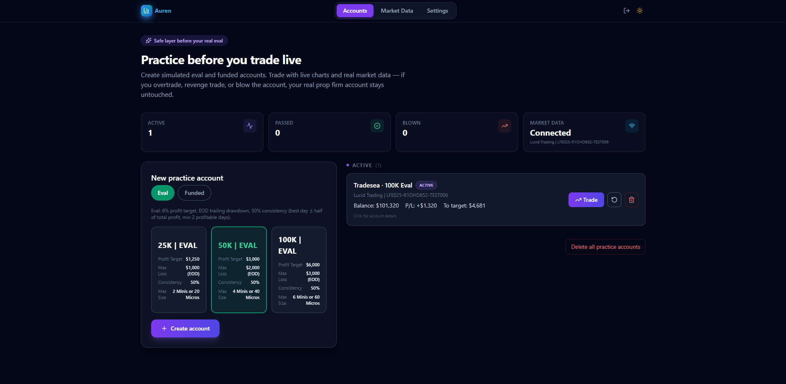
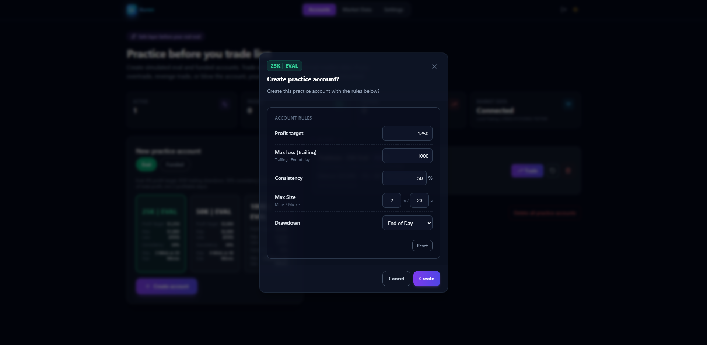
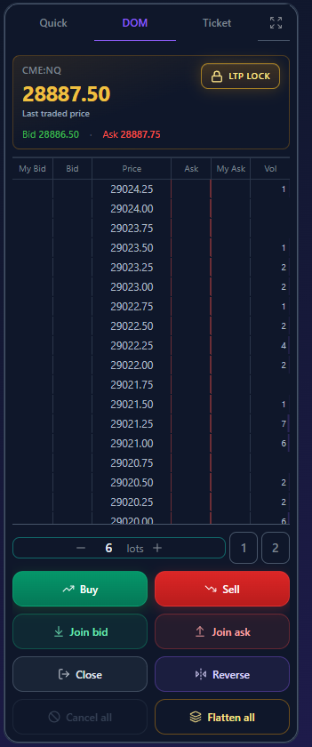
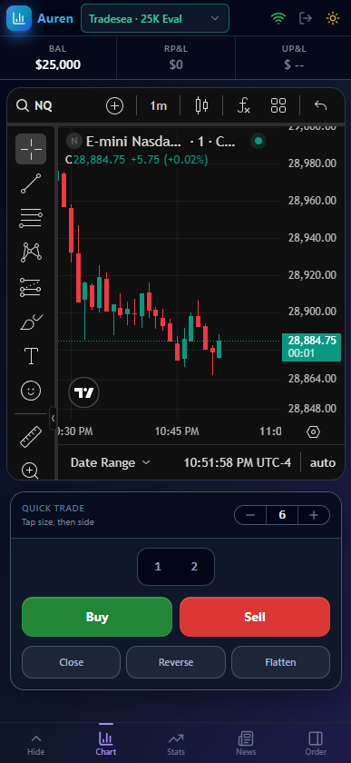
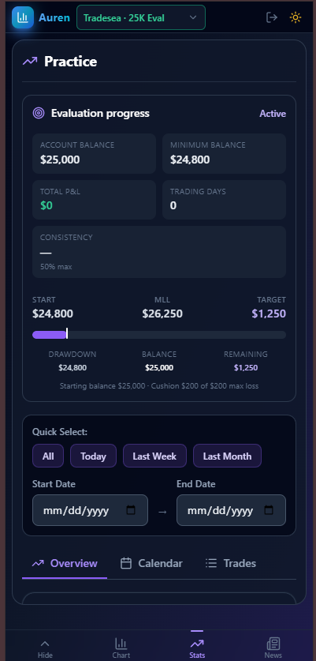
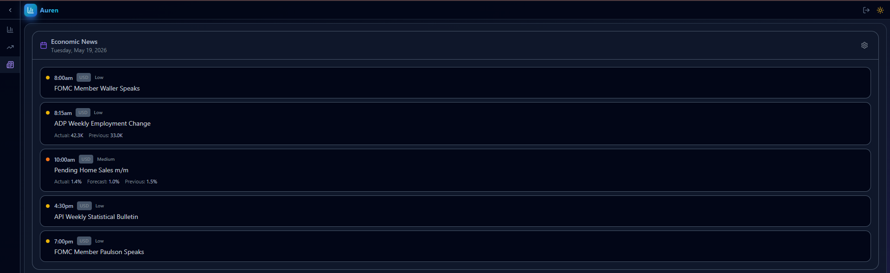

# Auren

**Practice-only** futures trading simulator. A safe layer between you and your real prop firm or eval account.

Create simulated **eval** and **funded** accounts, trade on live charts with real market data, and let rules, drawdowns, and lockouts play out on Auren. If you overtrade, revenge trade, or blow the account, your real prop firm balance stays untouched.

## Features

### Auren (home)

- Simulated **25K / 50K / 100K** eval and funded accounts: create, reset, delete
- **Custom rules** when opening an account: profit target, max loss, drawdown type, consistency, commissions, contract caps
- **Tradesea** market data for practice charts
- Account states: **active**, **passed**, **blown** with dashboard stats
- Embedded **settings**: profile, market data, keyboard shortcuts, timezone

### Trading terminal

- **[BetterweightChart](https://github.com/parbhatc/BetterweightChart)** charts (lightweight-charts v5, drawings, indicators) with Tradesea market data
- **Practice simulation** and **live Tradesea** trading (Lucid / sandbox) on the same chart stack
- **DOM ladder** and order ticket: market, limit, join bid/ask, close, reverse, flatten, cancel-all
- **Draggable SL/TP** on the chart; bracket tracking when offline (where supported)
- **Detachable** trade panel and **resizable** layout regions
- **Eval progress** on-chart: balance, trailing max loss, profit target, consistency

### Session discipline

- **Daily loss lockout** (session resets 6pm ET)
- **Max trades per session** (optional)
- **Self-lock** presets or custom duration; manual unlock when ready
- **Lockout card** and header controls on the trade screen

### Stats and news

- **Evaluation dashboard**: drawdown cushion, consistency, profitable days, trade history
- **Economic calendar** with currency and impact filters while you practice

### Market data

- Connect **Tradesea** via email OTP or manual session cookies
- **MDS WebSocket** stream: candles, last price, depth, quotes
- Connection status, auto-reconnect, and **connect on limit** (retries when the firm connection cap is hit)
- **Offline mode** option to hold an MDS slot and track brackets while away from the chart

### Mobile

- Bottom nav: chart, stats, news, order entry
- **Quick trade** card with minimize / expand and optional **floating** scalp pad
- Mobile order sheet and touch-friendly qty chips

### Platform

- Dark / light theme
- Auth: register, login, email verification, password reset
- Admin: users, roles, server config (self-hosted)
- English UI copy via `en.json`

There is **no third-party prop-firm order routing** beyond Tradesea accounts you connect yourself. Practice accounts remain fully simulated on Auren.

## Screenshots

### Auren

Create and manage simulated accounts, connect market data, and pick eval or funded rules.



### Create account

Set profit target, drawdown, consistency, and contract limits when opening a new practice eval.



### Trading terminal

Chart, trade panel, DOM ladder, and simulated fills with position lines on the chart.


### Order panel

Quick trade, DOM, and order entry in the docked trade panel.



### Mobile chart

Practice on a phone-sized layout with chart and scalp controls.



### Mobile stats

Evaluation progress and session stats on mobile.



### Economic news

Session calendar and headlines while you practice.



## Routes

| Route | Purpose |
|-------|---------|
| `/` | Auren home: accounts, market data, settings |
| `/trade/:id` | Practice trading terminal (chart + trade panel) |
| `/live/trade` | Live Tradesea trading terminal |
| `/trade/:id/stats` | Session statistics and eval progress |
| `/trade/:id/news` | Economic news calendar |
| `/settings` | Profile and account settings |
| `/settings/props` | Market data / prop firm connection |
| `/settings/keyboard-shortcuts` | Terminal hotkeys |
| `/settings/utils` | Timezone and utilities |
| `/login`, `/register` | Authentication |

## Prerequisites

- [Node.js](https://nodejs.org/) 18+ (20 LTS recommended)
- npm 9+
- (Optional) Tradesea account for live/delayed futures chart data and live trading

## Quick start

### 1. Clone and install

```bash
git clone <repository-url>
cd Auren
npm install
npm run sync-bwc-vendor
cd server && npm install && cd ..
```

`npm install` pulls **[BetterweightChart](https://github.com/parbhatc/BetterweightChart)** from GitHub (`betterweightchart` dependency). Then `npm run sync-bwc-vendor` copies `lightweight-charts` into the chart package’s `public/vendor/` (required because dependency postinstall scripts are skipped via `.npmrc`). No local sibling checkout is required.

`package-lock.json` is not committed. Run `npm install` in the repo root and in `server/` to generate lockfiles locally.

### 2. Chart engine (BetterweightChart)

Charts are powered by the open-source **[BetterweightChart](https://github.com/parbhatc/BetterweightChart)** package, installed automatically from GitHub:

```json
"betterweightchart": "github:parbhatc/BetterweightChart"
```

Vite serves `/chart/*`, `/js/*`, `/css/*`, `/vendor/*`, and `/testing/js/*` from `node_modules/betterweightchart/` during dev and copies them into `dist/` on production build.

To update to the latest chart release:

```bash
npm update betterweightchart
npm run sync-bwc-vendor
npm run build
```

Do **not** clone BetterweightChart next to Auren — the app no longer uses `../BetterweightChart`.

`.npmrc` sets `ignore-scripts=true` so the chart package’s postinstall does not fail when dependencies are hoisted; run `npm run sync-bwc-vendor` after every `npm install` or `npm update betterweightchart`.

### 3. Environment

**Frontend** (optional):

```bash
cp .env.example .env
```

Default dev setup uses the Vite proxy; you usually do not need `VITE_API_URL`.

**Backend** (required):

```bash
cp server/.env.example server/.env
```

Edit `server/.env`:

```env
PORT=3001
CORS_ORIGIN=http://localhost:3000
JWT_SECRET=replace-with-a-long-random-secret
```

Never commit `.env` files or `server/data/`.

### 4. Email (optional)

For signup and password reset, configure SMTP in `server/data/config.json` (gitignored). Without SMTP, the API logs email payloads to the console. See [server/README.md](server/README.md#setup).

### 5. Run locally

**Terminal 1 — API**

```bash
cd server
npm start
```

API: `http://localhost:3001`

**Terminal 2 — Web app**

```bash
npm run dev
```

App: `http://localhost:3000` (Vite proxies `/api` to the backend)

### 6. First-time use

On a fresh install (empty database), the server creates a default admin account:

| Field | Value |
|-------|-------|
| Username | `admin` |
| Password | `admin` |

Change this password after first login. You can also register a new account if signup is enabled.

1. Log in with the default admin account, or register a new user.
2. Open **Settings → Market data** and connect Tradesea for charts (orders remain simulated).
3. On **Auren**, create a **25K Eval** (or other size).
4. Open **Trade** on that account.

## Production build

```bash
npm run build
```

Output is in `dist/`. Serve it behind your API (same origin or set `CORS_ORIGIN` on the server). BetterweightChart static assets are bundled into `dist/chart`, `dist/js`, etc. automatically during `npm run build`.

## Project structure

```text
Auren/
├── src/                    # React + TypeScript frontend
├── server/                 # Express API, SQLite, auth, practice engine
├── public/                 # Static assets (favicon, etc.)
├── images/                 # README screenshots
├── node_modules/
│   └── betterweightchart/  # Chart SDK (from github:parbhatc/BetterweightChart)
└── package.json
```

## License and third-party notices

- **Auren** application code: see repository license (if provided).
- **[BetterweightChart](https://github.com/parbhatc/BetterweightChart)**: MIT — chart widget, drawings, and indicators (installed via npm from GitHub).
- **Market data**: subject to your provider’s terms (e.g. Tradesea).

## Contributing

Issues and pull requests are welcome. Do not commit secrets, `server/data/`, local check scripts, or lockfiles listed in `.gitignore`.
